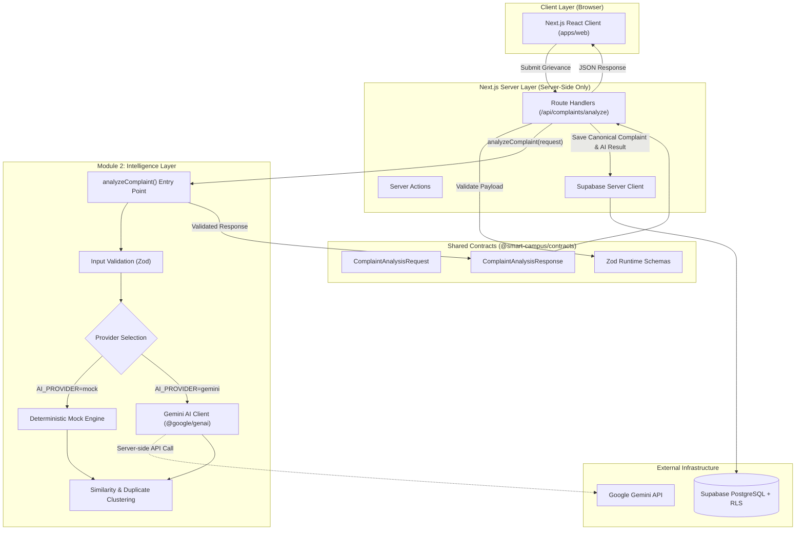
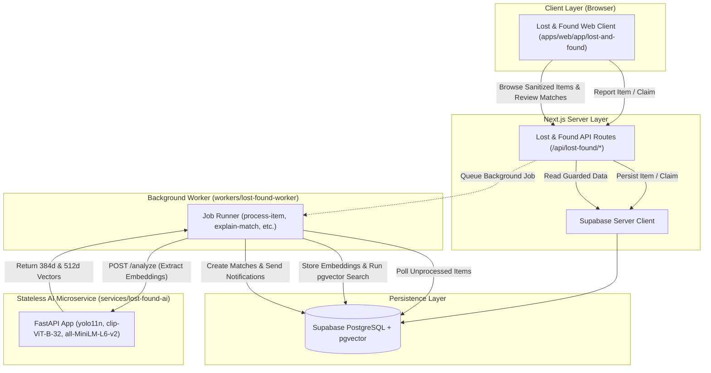
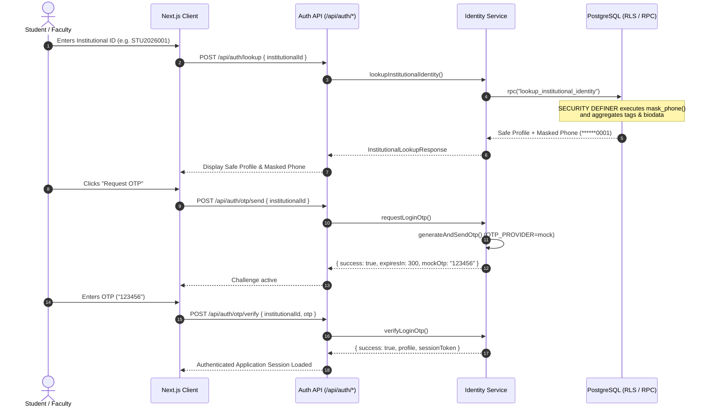

# ARCHITECTURE.md — Smart Campus System Architecture

## 1. High-Level Architectural Diagram

---

## 2. Module 3: Lost & Found Architecture

---

## 3. Monorepo Layer Responsibilities

| Layer / Workspace             | Path                             | Key Responsibilities                                                                                                             |
| :---------------------------- | :------------------------------- | :------------------------------------------------------------------------------------------------------------------------------- |
| **Main App**                  | `apps/web`                       | Next.js App Router, campus portal, complaints UI, Lost & Found UI (`/lost-and-found`), and API routes.                           |
| **Complaint Intelligence**    | `modules/complaint-intelligence` | Categorization, severity scoring, location/entity extraction, clustering, Gemini API calls. Pure logic, zero React dependencies. |
| **Lost & Found Intelligence** | `modules/lost-and-found`         | Multimodal matching score, state machine transitions, privacy sanitization, storage abstraction, and contract validations.       |
| **Lost & Found AI Service**   | `services/lost-found-ai`         | Stateless Python FastAPI microservice running YOLO11n, CLIP, and MiniLM models.                                                  |
| **Lost & Found Worker**       | `workers/lost-found-worker`      | Node.js background process for async embedding generation, matching sweeps, and notification dispatch.                           |
| **Contracts**                 | `packages/contracts`             | TypeScript interfaces and Zod schemas shared across all modules (`complaint`, `posts`, `users`, `lost-and-found`).               |
| **Shared UI**                 | `packages/ui`                    | Common UI primitives (Button, Card, Badge) styled with Tailwind CSS.                                                             |
| **Shared Utils**              | `packages/utils`                 | Pure utility functions (`cn`, custom errors, date formatters).                                                                   |
| **Shared Config**             | `packages/config`                | Shared TypeScript and ESLint configurations.                                                                                     |
| **Supabase**                  | `supabase/`                      | SQL migrations (`001_initial_schema.sql`, `002_lost_and_found.sql`), seed data, and local configuration.                         |

---

## 3. Data Flow & Security Boundaries

1. **Client / Browser:**
   - Submits requests to internal Next.js API endpoints (`/api/complaints/analyze`).
   - Only has access to public environment variables (`NEXT_PUBLIC_SUPABASE_URL`, `NEXT_PUBLIC_SUPABASE_ANON_KEY`).
   - NEVER makes direct calls to Google Gemini.

2. **Next.js Server:**
   - Possesses `GEMINI_API_KEY` and optional `SUPABASE_SERVICE_ROLE_KEY`.
   - Validates incoming payload using `@smart-campus/contracts`.
   - Dispatches analysis to `analyzeComplaint(request)` from `@smart-campus/complaint-intelligence`.

3. **Complaint Intelligence Processing (Module 2):**
   - Strictly decoupled from Next.js UI components.
   - Operates in either **Mock** or **Gemini** mode based on `AI_PROVIDER` and available keys.
   - Always validates AI outputs against Zod schemas before returning to caller.

4. **Persistence & Data Ownership:**
   - Module 1 owns canonical complaint state (`public.complaints`).
   - AI outputs are stored in `public.complaint_ai_analysis` referencing `complaints.id`.
   - No parallel user or complaint tables are created by Module 2.

---

## 4. Institutional Identity & Authentication Architecture

### Identity Data Model

- **`departments`**: Normalized academic and administrative units (`code`, `name`, `is_active`).
- **`programs`**: Degrees offered (`code`, `name`, `degree`, `duration_years`, `department_id`).
- **`institutional_users`**: Master student/faculty records (`institutional_id`, `full_name`, `phone` (sensitive), `email`, `primary_role`, `linked_profile_id`).
- **`student_biodata`**: Academic metrics (`admission_year`, `graduation_year`, `academic_year`, `current_semester`, `section`).
- **`faculty_biodata`**: Professional metrics (`designation`, `department_id`, `joining_year`).
- **`institutional_user_tags`**: Many-to-many responsibility mappings (`CAS_COORDINATOR`, `DEPARTMENT_COORDINATOR`, `COURSE_COORDINATOR`, `CLASS_COORDINATOR`, `HOD`).
- **`institutional_otp_sessions`**: Time-limited challenge verification tracking.
