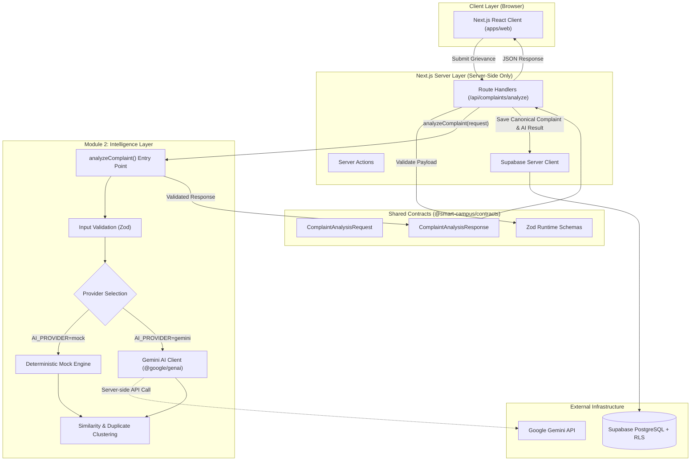

# ARCHITECTURE.md — Smart Campus System Architecture

## 1. High-Level Architectural Diagram

---

## 2. Monorepo Layer Responsibilities

| Layer / Workspace       | Path                             | Key Responsibilities                                                                                                             |
| :---------------------- | :------------------------------- | :------------------------------------------------------------------------------------------------------------------------------- |
| **Main App**            | `apps/web`                       | Next.js App Router, page layouts, student/admin views, API route handlers.                                                       |
| **Intelligence Module** | `modules/complaint-intelligence` | Categorization, severity scoring, location/entity extraction, clustering, Gemini API calls. Pure logic, zero React dependencies. |
| **Contracts**           | `packages/contracts`             | TypeScript interfaces and Zod schemas shared across all modules (`ComplaintAnalysisRequest`, `ComplaintAnalysisResponse`).       |
| **Shared UI**           | `packages/ui`                    | Common UI primitives (Button, Card, Badge) styled with Tailwind CSS.                                                             |
| **Shared Utils**        | `packages/utils`                 | Pure utility functions (`cn`, custom errors, date formatters).                                                                   |
| **Shared Config**       | `packages/config`                | Shared TypeScript and ESLint configurations.                                                                                     |
| **Supabase**            | `supabase/`                      | SQL migrations, seed data, and local configuration.                                                                              |

---

## 3. Data Flow & Security Boundaries

1. **Client / Browser:**
   - Submits requests to internal Next.js API endpoints (`/api/complaints/analyze`).
   - Only has access to public environment variables (`NEXT_PUBLIC_SUPABASE_URL`, `NEXT_PUBLIC_SUPABASE_ANON_KEY`).
   - NEVER makes direct calls to Google Gemini.

2. **Next.js Server:**
   - Possesses `GEMINI_API_KEY` and optional `SUPABASE_SERVICE_ROLE_KEY`.
   - Validates incoming payload using `@smart-campus/contracts`.
   - Dispatches analysis to `analyzeComplaint(request)` from `@smart-campus/complaint-intelligence`.

3. **Complaint Intelligence Processing (Module 2):**
   - Strictly decoupled from Next.js UI components.
   - Operates in either **Mock** or **Gemini** mode based on `AI_PROVIDER` and available keys.
   - Always validates AI outputs against Zod schemas before returning to caller.

4. **Persistence & Data Ownership:**
   - Module 1 owns canonical complaint state (`public.complaints`).
   - AI outputs are stored in `public.complaint_ai_analysis` referencing `complaints.id`.
   - No parallel user or complaint tables are created by Module 2.
