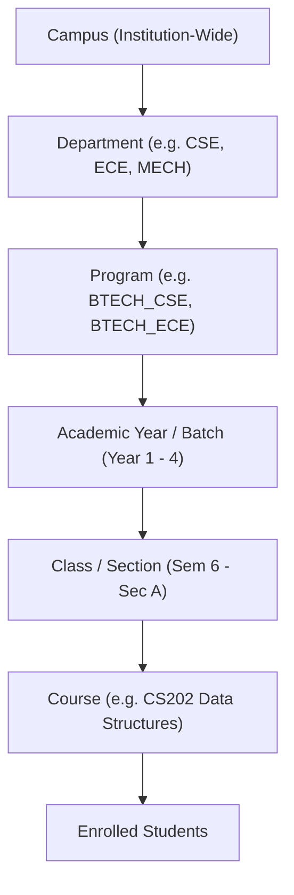
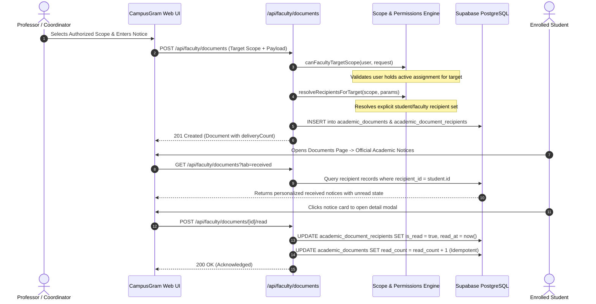

# Module 1 — Faculty Academic Communication & Document Management Architecture

## 1. Executive Summary & Purpose

The **Faculty Academic Communication & Document Management System** in CampusGram enables professors, course coordinators, class coordinators, department heads (HODs), and academic leadership to publish, distribute, and track formal academic communications with audited delivery, verified read receipts, and scoped student submission management.

This module is an integral part of **Module 1 (CampusGram)** and strictly adheres to the core architectural principles:
- **Zero Identity Duplication**: Directly reuses `auth.users`, `public.profiles`, and `public.institutional_users`.
- **Relational Academic Assignment**: Faculty authority is established through explicit relational assignment records (`faculty_academic_assignments`), mapping faculty to courses, classes, sections, and departments.
- **Server-Side Scope Derivation**: Recipient user lists are computed entirely server-side based on the target academic scope. Clients never supply recipient IDs, eliminating privilege escalation.
- **Audited Delivery & Read Receipts**: Real-time read tracking with timestamps and percentage progress bars without double-counting.
- **Cross-Department Boundary Protection**: Normal faculty members are strictly confined to their assigned course/class scope; cross-department notices are restricted exclusively to Head of Department (HOD) leadership.

---

## 2. Academic Hierarchy & Data Modeling

The institutional academic structure models higher education institutions:

### Relational Schema (Migration `007_faculty_academic_documents.sql`)

1. **`courses`**:
   - `id`: UUID Primary Key
   - `code`: VARCHAR(30) UNIQUE (e.g. `CS202`, `CS401`)
   - `name`: TEXT (e.g. `Data Structures & Algorithms`)
   - `department_id`, `department_code`: Foreign key to institutional departments
   - `program_id`, `program_code`: Associated academic program
   - `semester`, `credits`, `is_active`: Academic syllabus parameters

2. **`faculty_academic_assignments`**:
   - Relates an institutional faculty member to an academic responsibility.
   - `assignment_type`: `class` | `course` | `program` | `department`
   - `faculty_institutional_user_id`: UUID referencing `institutional_users(id)`
   - `course_id`, `course_code`, `course_name`: For course coordinator / teaching instructor assignments
   - `program_id`, `academic_year`, `semester`, `section`: For class coordinator assignments
   - `role_title`: Formal title (e.g., `Class Coordinator (CSE Year 3 - Sec A)`)
   - `academic_session`: Academic year (e.g., `2025-2026`)
   - `is_active`: Boolean flag

3. **`academic_documents`**:
   - `id`: UUID Primary Key
   - `sender_profile_id`, `sender_institutional_user_id`: Sending faculty member
   - `sender_name`, `sender_role`, `sender_department`: Denormalized sender metadata
   - `document_type`: Academic document type (see Section 4)
   - `title`, `content`: Communication text
   - `priority`: `low` | `normal` | `high` | `urgent`
   - `deadline`: Optional ISO timestamp for student action / submission
   - `status`: `DRAFT` | `SENT` | `DELIVERED` | `READ` | `ARCHIVED`
   - `target_scope`: `class` | `course` | `department` | `faculty` | `cross_department` | `campus`
   - `target_display_name`: Human-readable scope label (e.g., `CSE Year 3 Sem 6 (Sec A)`)
   - `delivery_count`, `read_count`: Running aggregation metrics
   - `attachments`: JSONB array of attached files with storage paths and file sizes

4. **`academic_document_recipients`**:
   - `document_id`: Foreign key referencing `academic_documents(id)`
   - `recipient_institutional_user_id`: Target recipient
   - `recipient_role`: `student` | `faculty` | `staff` | `admin`
   - `is_read`: Boolean flag
   - `read_at`: Timestamp of first acknowledgement
   - Compound index on `(document_id, recipient_institutional_user_id)`

5. **`academic_document_events`**:
   - Audit trail capturing `CREATED`, `DISPATCHED`, `READ_ACKNOWLEDGED`, and `ARCHIVED` events.

---

## 3. Server-Side Scope Authorization Matrix

| User Role / Tag | Class Scope | Course Scope | Department Students | Department Faculty | Cross-Department | Institution Campus |
|---|---|---|---|---|---|---|
| **Student** | ❌ Denied | ❌ Denied | ❌ Denied | ❌ Denied | ❌ Denied | ❌ Denied |
| **Faculty (Course Coord)** | ❌ (Unless assigned) | ✅ Assigned Course Only | ❌ Denied | ❌ Denied | ❌ Denied | ❌ Denied |
| **Faculty (Class Coord)** | ✅ Assigned Class/Sec Only | ❌ (Unless assigned) | ❌ Denied | ❌ Denied | ❌ Denied | ❌ Denied |
| **Department Coordinator** | ✅ Department Classes | ✅ Department Courses | ✅ Dept Students | ✅ Dept Faculty | ❌ Denied | ❌ Denied |
| **Head of Department (HOD)** | ✅ All Dept Classes | ✅ All Dept Courses | ✅ All Dept Students | ✅ All Dept Faculty | ✅ Other Dept Leadership | ❌ Denied |
| **Institutional Admin** | ✅ All Classes | ✅ All Courses | ✅ All Departments | ✅ All Faculty | ✅ Cross-Dept | ✅ Campus-Wide |

---

## 4. Formal Academic Document Types

CampusGram enforces 15 formal academic document types with zero slang or informal messaging:

1. `Academic Notice`
2. `Assignment`
3. `Assessment Notice`
4. `Exam Schedule`
5. `Class Schedule`
6. `Course Material`
7. `Syllabus / Curriculum`
8. `Workshop / Seminar Notice`
9. `Attendance Notice`
10. `Academic Circular`
11. `Department Notice`
12. `Course Announcement`
13. `Meeting Notice`
14. `Academic Reminder`
15. `Other Academic Document`

---

## 5. Recipient Resolution & Delivery Tracking Flow

---

## 6. Student Submission Evaluation Workflow

Assigned course instructors and class coordinators evaluate student submissions:
- **Endpoints**:
  - `GET /api/faculty/student-submissions`: Returns student submissions strictly filtered to courses and classes assigned to the requesting faculty member.
  - `POST /api/faculty/student-submissions/[id]/review`: Records review verdict (`ACCEPTED`, `RETURNED`, `UNDER_REVIEW`) and constructive instructor remarks.
- **Zero Information Leakage**: A course coordinator cannot access or evaluate submissions from courses they do not instruct.

---

## 7. API Reference

| Method | Endpoint | Description | Access Control |
|---|---|---|---|
| `GET` | `/api/faculty/overview` | Aggregates unread count, sent count, pending submissions, assignments | Faculty / Admin |
| `GET` | `/api/faculty/scopes` | Returns pre-computed authorized target scopes for the faculty member | Faculty / Admin |
| `GET` | `/api/faculty/assignments` | Returns active academic assignments (courses, classes, sections) | Faculty / Admin |
| `GET` | `/api/faculty/documents` | Paginated documents list (`?tab=received\|sent&filter=...&search=...`) | Authenticated |
| `POST` | `/api/faculty/documents` | Publishes academic notice; handles optional file upload | Faculty / Admin |
| `GET` | `/api/faculty/documents/[id]` | Document detail with attachments and recipient read metrics | Authorized Viewer |
| `POST` | `/api/faculty/documents/[id]/read` | Acknowledges receipt and marks notice as read | Recipient |
| `GET` | `/api/faculty/student-submissions` | Retrieves submissions within assigned academic scopes | Faculty / Admin |
| `POST` | `/api/faculty/student-submissions/[id]/review` | Records submission evaluation verdict and remarks | Assigned Faculty |

---

## 8. Deterministic Mock Mode

In local development or when `AI_PROVIDER=mock`, the system operates with zero external network dependencies using deterministic mock databases (`faculty-academic-seed-data.ts` and `mock-identities.ts`):
- `MOCK_COURSES`: 5 institutional courses (`CS202`, `CS401`, `CS301`, `EC303`, `EC305`).
- `MOCK_FACULTY_ASSIGNMENTS`: Pre-configured assignments for Dr. Aris Thorne (CSE HOD), Prof. Radhika Seth (Class Coordinator Year 3 Sec A), Dr. Alok Verma (Course Coordinator CS202), Dr. Sundar Pichai (Course Coordinator CS401), and Dr. Elena Vance (ECE HOD).
- All contracts, RLS logic, and validations run identically in mock mode and production database mode.
