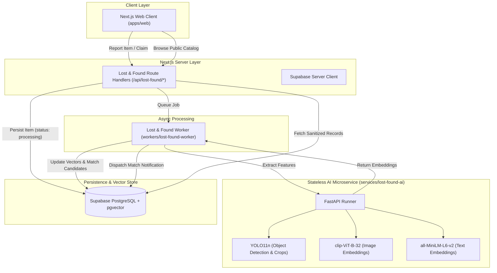

# Module 3 — Lost & Found System Specification

## 1. Purpose

The Smart Campus Lost & Found System provides an intelligent, privacy-preserving, and campus-wide platform to report, match, verify, and return lost property. It replaces informal social media posts and uncoordinated lost-and-found boxes with automated multimodal matching, verifiable ownership claims, and controlled handovers.

---

## 2. Goals

- **Multimodal AI Similarity**: Correlate visual embeddings (CLIP), semantic text embeddings (MiniLM), category classification, location proximity, and time decay into an empirical match score.
- **Privacy & Fraud Prevention**: Redact sensitive marks, serial numbers, and private item contents from public directories. Contact information is never released automatically upon matching.
- **Controlled Handover Protocols**: Facilitate safe return of items via in-person consent windows or campus security custody.
- **Asynchronous Architecture**: Heavy ML embeddings and vector candidate queries are handled asynchronously via background workers to keep Next.js request handlers fast and responsive.

---

## 3. Non-Goals

- Real-time video stream surveillance tracking.
- Automated monetary rewards or payment processing between students.
- Permanent archiving of sensitive personal identification documents.

---

## 4. Architecture



---

## 5. Responsibilities & Ownership Boundaries

- **Developer C Ownership**:
  - `modules/lost-and-found/`: Pure domain logic (scoring, state machine, privacy, storage adapters).
  - `services/lost-found-ai/`: Stateless Python FastAPI microservice for feature embeddings.
  - `workers/lost-found-worker/`: Background job execution (processing, notifications, expiration).
  - `apps/web/app/lost-and-found/`: User interface pages.
  - `apps/web/app/api/lost-found/`: Server route handlers.
- **Shared Infrastructure Rules**:
  - Uses authoritative `@smart-campus/contracts` for cross-boundary data shapes.
  - Links to canonical `public.profiles` in Supabase (no duplicate user tables).
  - Does NOT alter Module 1 portal feeds or Module 2 complaint algorithms.

---

## 6. Page Structure (`apps/web/app/lost-and-found/`)

- `/lost-and-found`: Hub dashboard with activity summaries and navigation.
- `/lost-and-found/report/lost`: Multi-step form for reporting lost property.
- `/lost-and-found/report/found`: Multi-step form for reporting found property.
- `/lost-and-found/browse`: Public directory with filters, search, and masked item cards.
- `/lost-and-found/my-reports`: Student dashboard tracking personal items, match alerts, and claims.
- `/lost-and-found/items/[id]`: Detailed view with privacy redaction for non-owners.
- `/lost-and-found/claims/[id]`: Interactive claim resolution, question prompts, and handover tracker.
- `/lost-and-found/admin`: Campus Security & Staff custody management.

---

## 7. API Routes (`apps/web/app/api/lost-found/`)

- `POST /api/lost-found/items`: Create lost or found item.
- `GET /api/lost-found/items`: Search and browse items.
- `GET /api/lost-found/items/[id]`: Retrieve single sanitized item.
- `PATCH /api/lost-found/items/[id]/status`: Trigger state machine transition.
- `GET /api/lost-found/items/[id]/matches`: Retrieve candidate matches for an item.
- `POST /api/lost-found/matches/[id]/claim`: Initiate ownership claim from match.
- `POST /api/lost-found/matches/[id]/dismiss`: Dismiss irrelevant candidate match.
- `POST /api/lost-found/claims/[id]/answer`: Submit answers to verification questions.
- `POST /api/lost-found/claims/[id]/decide`: Finder/staff decision (approve/reject/question).
- `GET /api/lost-found/claims/[id]/contact`: Retrieve contact info (strictly guarded).
- `POST /api/lost-found/claims/[id]/handover`: Schedule or complete handover.
- `GET /api/lost-found/admin`: Retrieve security intake queues and custody items.

---

## 8. Data Model (`supabase/migrations/002_lost_and_found.sql`)

- `lost_found_locations`: Designated drop-off desks, security posts, and building zones.
- `lost_found_items`: Canonical records with `public_description`, `private_description`, `identifying_marks`, and pgvector embedding columns (`vector(384)` and `vector(512)`).
- `lost_found_item_images`: Storage paths, public URLs, sensitive flags, and object tags.
- `lost_found_matches`: Precomputed similarity scores with breakdown (`high`, `medium`, `low`).
- `lost_found_claims`: Claim verification dialogue, status, and decisions.
- `lost_found_contact_reveals`: Audit log tracking who revealed contact info, when, and expiry.
- `lost_found_item_events`: Audit timeline for all status modifications.
- `lost_found_notifications`: In-app notification queue for matches and claim actions.

---

## 9. AI Service Architecture

- Stateless microservice built on FastAPI.
- **YOLO11n**: Detects bounding boxes for cropping out backgrounds and focusing on item geometry.
- **OpenAI CLIP (`clip-ViT-B-32`)**: Produces 512-dimensional visual embedding vectors.
- **Sentence-Transformers (`all-MiniLM-L6-v2`)**: Produces 384-dimensional text semantic embeddings.
- **Startup Loading**: Models loaded into memory during app lifespan startup.
- **Deterministic Fallback**: Automatic mock mode enables full local development without heavy GPU/CUDA setups.

---

## 10. Matching Engine & Scoring Heuristics

Baseline weights from build guide (empirical index, not probability):

- **Image Similarity**: 45% (`0.45`)
- **Text Semantic Similarity**: 25% (`0.25`)
- **Category Match**: 10% (`0.10`)
- **Location Proximity**: 10% (`0.10`)
- **Time Proximity**: 10% (`0.10`)

**Classification Bands**:

- `overall_score >= 0.80`: **High** (Strong Match surfaced prominently).
- `0.65 <= overall_score < 0.80`: **Medium** (Possible Match surfaced for user review).
- `overall_score < 0.65`: **Low** (Hidden from student feeds).

---

## 11. State Machine

```text
           [processing]
                │
                ▼
             [open] ──────┬──────> [withdrawn]
              │   ▲       │
     claim    │   │ reject│ timeout
     filed    ▼   │       ▼
           [in_claim]   [expired]
                │
         approve│
                ▼
           [handover]
                │
         confirm│
                ▼
           [resolved]
```

---

## 12. Verification & Claim Protocol

1. Claimant spots potential match or item in browse catalog.
2. Claimant files claim with description of unlisted features (e.g. lock-screen photo, serial digits, inside contents).
3. Finder or Campus Security reviews answers. Can request clarification questions.
4. If satisfied, claim is approved.

---

## 13. Privacy & Contact Protection

- **No Direct Release on Match**: A similarity score of 0.99 DOES NOT reveal the finder's or loser's phone number or email.
- **Sanitization**: `private_description` and `identifying_marks` are set to `null` for unverified viewers.
- **Sensitive Item Handling**: Photos of wallets, passports, keys, or IDs are blurred or hidden from public browsing.
- **Contact Release Constraints**: Allowed only if claim is approved, parties have opted in, handover mode is `in_person`, and the contact window is active.
- **Audit Logging**: Every single contact reveal event writes to `lost_found_contact_reveals`.

---

## 14. Background Worker Responsibilities

- Runs out-of-band to prevent request latency.
- Executes `process-item`, `explain-match`, `send-notification`, and maintenance sweeps (`expire-items`, `close-contact-windows`).

---

## 15. Testing Requirements

- Unit tests for scoring calculations and threshold bands.
- Unit tests for legal vs illegal state transitions.
- Unit tests for privacy sanitization and contact release authorization.
- Unit tests for Zod request/response schema parsing.

---

## 16. Definition of Done

The module foundation is complete when:

- Shared contracts are published in `@smart-campus/contracts`.
- Database schema migration is added in `supabase/migrations/002_lost_and_found.sql`.
- Pure domain logic in `modules/lost-and-found` passes all unit tests.
- Background worker and Python AI service have operational skeletons with deterministic offline fallbacks.
- Next.js UI routes and API route skeletons compile cleanly in `pnpm build`.
